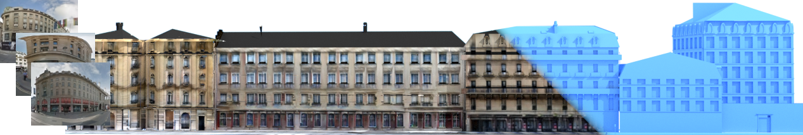

# Projective Urban Texturing



## Setup the experiment
* Clone the repository
* Download libigl and example scence data. [Link](https://ucy-my.sharepoint.com/:u:/g/personal/ygeorg01_ucy_ac_cy/EclwsJHnDlxLhZzg8HFBPUAB0ZgJdxb475k9Joaf5SGZZg?e=kiiwBz).
* Unzip and move checkpoints, libigl and scenes folders under PUT folder. 
* Run:
<code> python texture_mesh.py --scene_path ../scenes/005 --model_name consistency --blend custom </code>


## Extract dictionaries and 2D-3D correspondances.
* Run <code> python reprojection.py --scene_path ../scenes/005/ --mesh_name 005 --create_dict --create_3D_mapping </code>

## Extract viewpoints and renderings from a scene.
* Run the script that exist in blender file(blender_con.blend) and change the paths accordingly. This will result to grayscales rendering and viepoints' rotation and tranlation matrices.
* Use smart-unwrap to create uv coordinates and store your mesh as .obj file.

## Cite
```
  @inproceedings{PUT2021, 
  title={Projective Urban Texturing},
  author={Yiangos Georgiou and Melinos Averkiou and Tom Kelly and Evangelos Kalogerakis},
  booktitle={International Conference on 3D Vision (3DV)},
  year={2021}}
```
