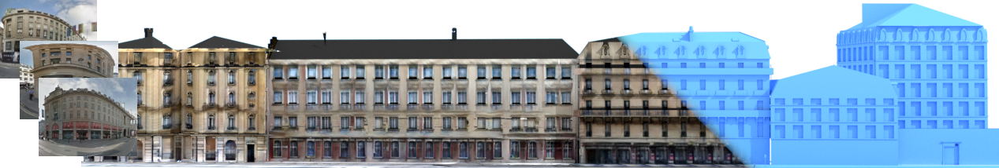
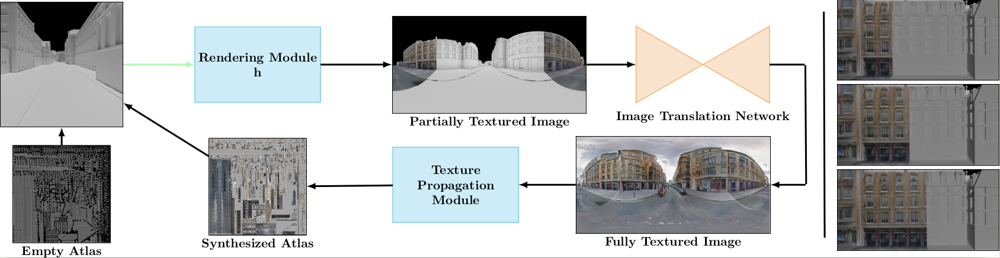
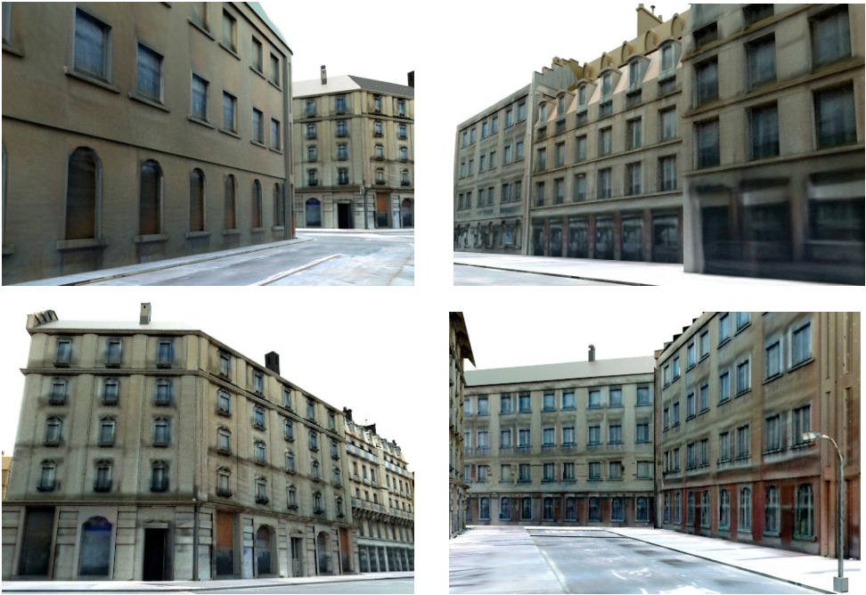

## Projective Urban Texturing
#### Yiangos Georgiou &emsp; Melinos Averkiou &emsp; Tom Kelly &emsp; Evangelos Kalogerakis

### Abstract

The creation of high quality textures for immersive ur-ban environments is a central component of the city model-ing problem, this paper proposes a method forautomatic generation of textures for 3D building modelsin immersive urban environments. Many recent pipelinescapture or synthesize large quantities of city geometry using scanners or procedural modeling pipelines. Such geometry is intricate and realistic, however the generationof photo-realistic textures for such large scenes remains aproblem - photo datasets are often panoramic and are chal-lenging to re-target to new geometry. To address these issues we present a neural architecture to generate photo-realistic textures for urban environments. Our Projective Urban Texturing (PUT) system iteratively re-targets textural style and detail from real-world panoramic images tounseen, unstructured urban meshes. The output is a texture atlas, applied onto the input 3D urban model geometry. PUT is conditioned on prior adjacent textures to ensureconsistency between consecutively generated textures. Weshow results for several generated texture atlases, learnedfrom two cities, and present quantitative evaluation of our outputs.

### Video(Presentation)

<iframe width="560" height="315" src="https://youtu.be/QN18pQsbXKQ" title="Youtube Video Player" frameborder="0"> </iframe>

### Pipeline

At each iteration our system creates a partially textured image by rendering the 3D geometry(top left) using the synthesized texture atlas from previous iterations. The texture propagation module uses the generated image to update the texture atlas. The updated atlas that contains the new textures is used for the next iteration. A visualization of our iterative texturing synthesis output is displayed on a building facade on the right.

### Results

Renderings textured by PUT trained on London panoramas. We show street-level renderings.
